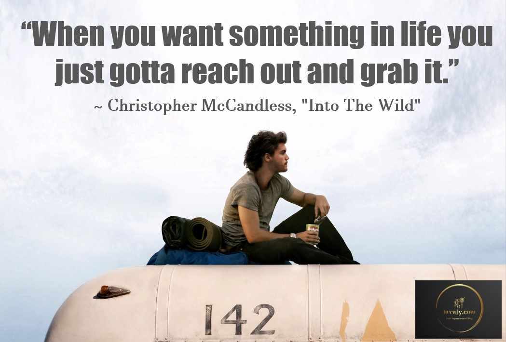
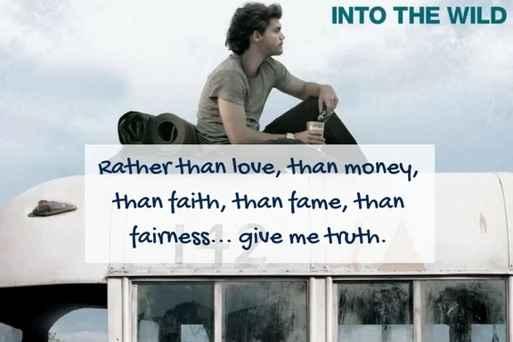

<h1 class="center">{{ page.title }}</h1>
This is one film that has influenced me a lot and untangled a lot of messed up threads in my mind. The film is shot beautifully if we talk about the aesthetics, music and scenes. Meanwhile, the content and storyline is equally moving, I watched it in the lockdown, and it had a profound impact on me as a person. 

<figure>
    
    <figcaption class="center">
        Into the wild poster

    </figcaption>
</figure>
<figure>
    
    <figcaption>
        {{ page.st }} with the bus where he stayed in Alaska.
    </figcaption>
</figure>

<figure>
    
</figure>

<figure>
    
</figure>